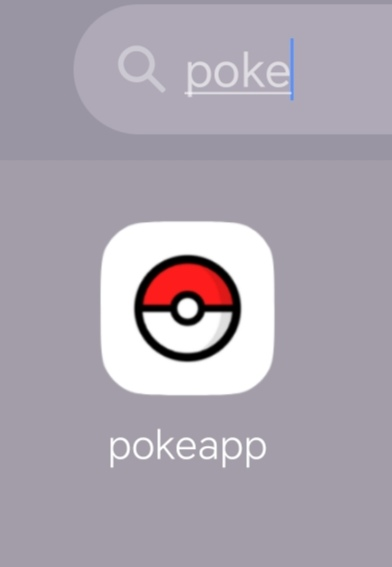
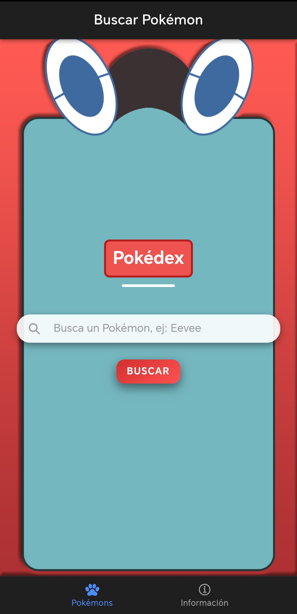
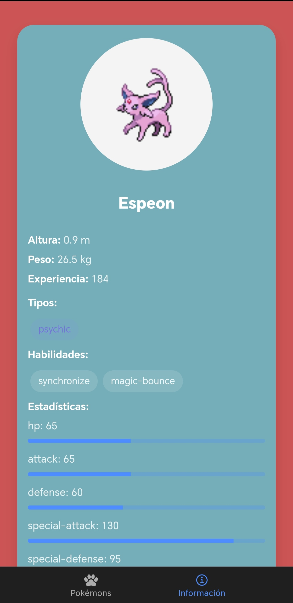

# 📱 Pokédex App - Ionic Angular

## 👨‍💻 Elaborado por

* Emily Galeas

## 📌 Descripción

Aplicación móvil desarrollada con Ionic y Angular que permite buscar un Pokémon por su nombre y visualizar toda su información consumiendo la API pública de PokéAPI.

---

## 🎯 Objetivo

Desarrollar una aplicación que:

* Permita buscar un Pokémon mediante su nombre
* Consuma un servicio REST externo
* Muestre todas las características del Pokémon buscado
* Implementar una Splash Screen y un Ícono Personalizado

---

## 🧱 Arquitectura de la aplicación

La aplicación está estructurada en dos vistas principales:

* **pokemon-list** → Vista de búsqueda
* **tab1** → Vista de resultados

Además, se implementa un servicio para el consumo de la API:

* **pokemon.service.ts** → Manejo de peticiones HTTP

---

## 🔄 Flujo de funcionamiento

1. El usuario ingresa el nombre del Pokémon en la vista de búsqueda
2. Presiona el botón "Buscar"
3. Se navega hacia la vista de resultados enviando el nombre como parámetro
4. La vista de resultados obtiene el parámetro desde la URL
5. Se realiza una petición HTTP a la API
6. Se muestran los datos del Pokémon en pantalla

---

## 🌐 Consumo de API

Se utiliza el siguiente endpoint:

```bash
https://pokeapi.co/api/v2/pokemon/{nombre}
```

Ejemplo:

```bash
https://pokeapi.co/api/v2/pokemon/pikachu
```

---

## ⚙️ Implementación

### 📥 Navegación entre vistas

Se utiliza el Router de Angular para enviar parámetros:

```ts
this.router.navigate(['/tab1', this.nombrePokemon.toLowerCase()]);
```

---

### 📌 Recepción de parámetros

Se utiliza `ActivatedRoute` para obtener el nombre del Pokémon:

```ts
this.route.paramMap.subscribe(params => {
  this.nombrePokemon = params.get('name')!;
  this.obtenerPokemon();
});
```

---

### 🔗 Consumo del servicio

El servicio realiza la petición HTTP:

```ts
getPokemonByName(name: string) {
  return this.http.get(`https://pokeapi.co/api/v2/pokemon/${name}`);
}
```

---

### 📊 Visualización de datos

Se muestran las siguientes propiedades del Pokémon:

* Nombre
* Imagen oficial
* Altura
* Peso
* Experiencia base
* Tipos
* Habilidades
* Estadísticas

---

### ⚠️ Manejo de errores

Se implementa control de errores en la petición HTTP:

```ts
error: () => {
  this.pokemon = null;
  this.loading = false;
  this.mostrarError();
}
```

Se muestra un mensaje cuando el Pokémon no existe.

---
## 📱 APLICACIÓN MÓVIL (ANDROID)

🔗 A continuación, se proporciona el enlace para descargar el archivo APK e instalar la aplicación en un dispositivo Android:
  - [Descargar aplicación Photo-Gallery](https://epnecuador-my.sharepoint.com/:u:/g/personal/emily_galeas_epn_edu_ec/IQCxyJam2mIwSLYceosvMKj8AYETqUXMM-EPE67pl9nPVGA?e=pa1RxF)

## 📸 Capturas de pantalla

| 📱 Icono | Splash Screen | 🔎 Búsqueda | ℹ Información |
|----------|----------|----------|----------|
|  |  |  |  |

### 📹 Video Funcionalidad


---

## ✅ Resultados obtenidos

* Se logró implementar la navegación entre vistas con parámetros
* Se consumió correctamente una API REST externa
* Se visualizaron los datos completos de un Pokémon
---
